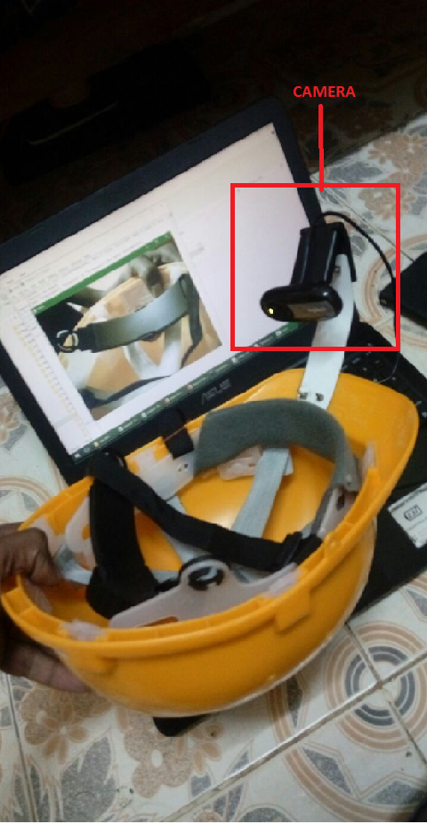

# An Artificial Neural Network Based Approach towards Eye Gesture Classification for Texting

### An Artificial Neural Network Based Approach towards Eye Gesture Classification for Texting

The task of typing using the gestures from the eye like left, right, centre, blink by obtaining the eye images from a camera feed has been worked on in this work. A multi-layered neural network is used to recognize the gestures from our eye and an accuracy of 91.6% has been obtained with the image data that were collected and used. With the recognized gestures, an application that aids people to type only using their eye gestures was developed. This method of texting minimizes the muscle movement for paralyzed people or people who suffer from acute illness who would find it difficult to communicate with any other means. The robustness of the application also proves that it can be applied on any handheld device substituting the normal process of texting using keyboard. 

# Hardware steup:

  

# Algorithm:

  

# Final GUI Window:

  

